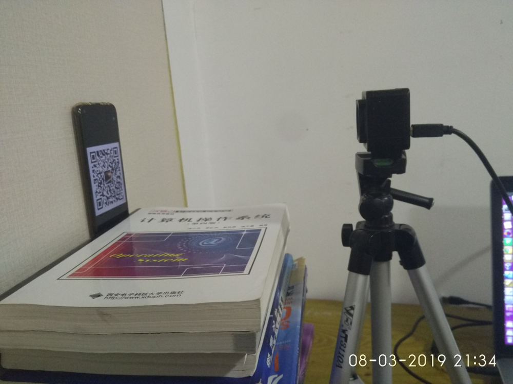
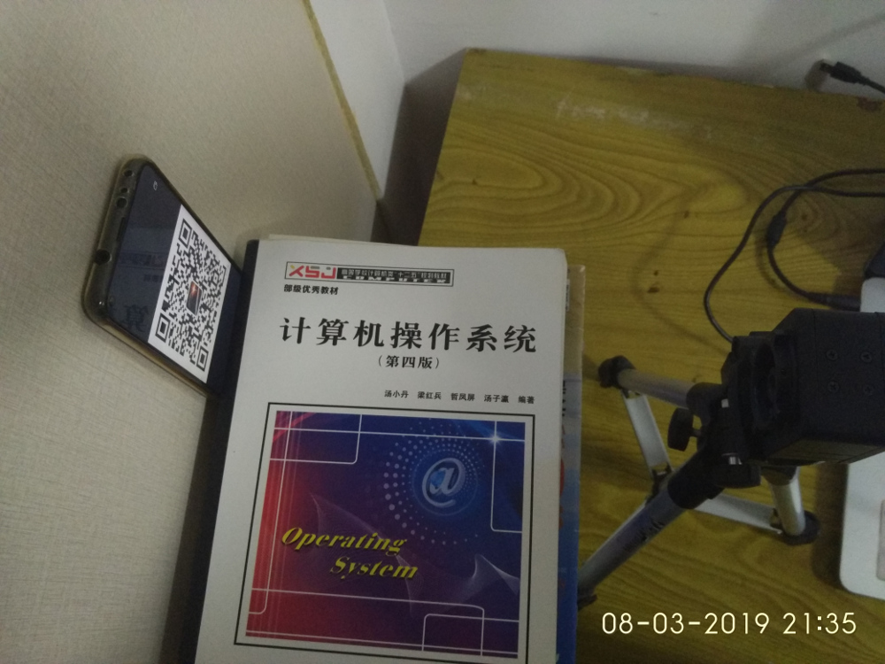
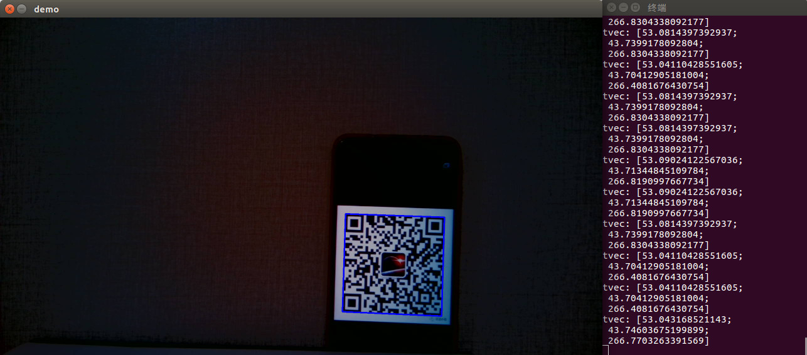
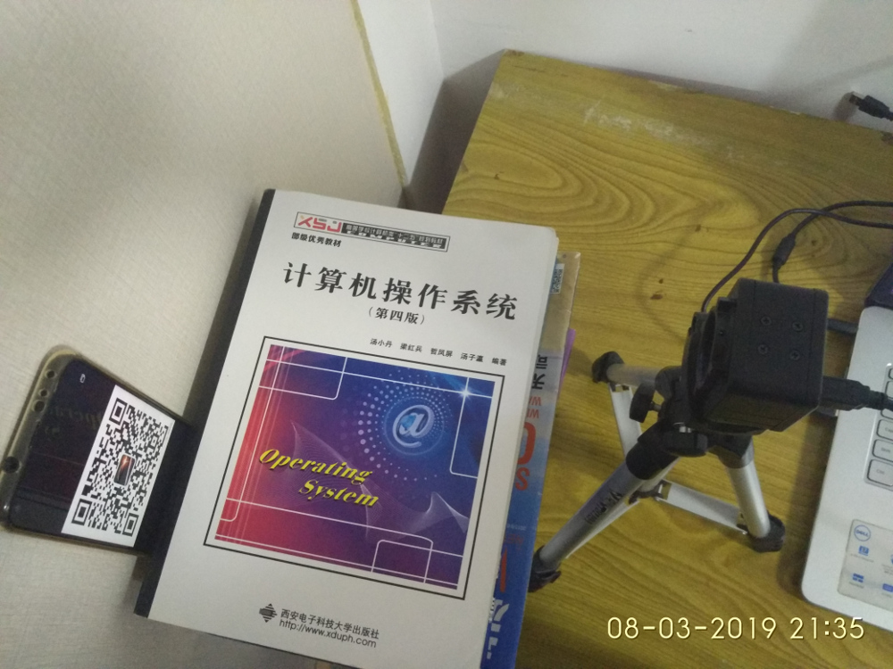
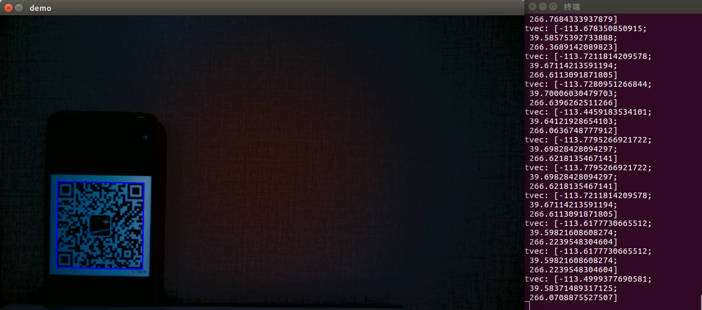

# pnpTest
使用solvePnP来测量二维码相对于摄像头的位置。二维码扫码代码参考：https://github.com/spmallick/learnopencv/tree/master/barcode-QRcodeScanner

解算位置的代码为以下几行：
```c
#define HALF_LENGTH 29.5
//自定义的物体世界坐标，单位为mm
vector<Point3f> obj=vector<Point3f>{
    cv::Point3f(-HALF_LENGTH, -HALF_LENGTH, 0),	//tl
    cv::Point3f(HALF_LENGTH, -HALF_LENGTH, 0),	//tr
    cv::Point3f(HALF_LENGTH, HALF_LENGTH, 0),	//br
    cv::Point3f(-HALF_LENGTH, HALF_LENGTH, 0)	//bl
};
cv::Mat rVec = cv::Mat::zeros(3, 1, CV_64FC1);//init rvec
cv::Mat tVec = cv::Mat::zeros(3, 1, CV_64FC1);//init tvec
//进行位置解算
solvePnP(obj,pnts,cam,dis,rVec,tVec,false,SOLVEPNP_ITERATIVE);
//输出平移向量
cout <<"tvec: "<<tVec<<endl;
```

`HALF_LENGTH` 为我手机上显示的二维码的一半的长度，点坐标的定义是按照从左上角开始顺时针依次定义的，在解算完PnP后得到的平移向量用`cout`输出。

这是我的实验环境，摄像头与手机平面平行（当然肯定还是有点歪的），手机用一本书夹住并且可以在夹槽中移动改变位置。



将手机放在右侧，如下图：



此时在摄像头拍摄的图片中，可以得到二维码中心的坐标为（53.04,43.74,266.77）



将手机放在左侧，如下图：



此时在摄像头拍摄的图片中，可以得到二维码中心的坐标为（-113.49,39.58,266.07）



可以看到二维码的z坐标基本上没有变，而x坐标变化非常大，y坐标按照理想情况不应该变，但是由于摄像头还是有点歪就有了些许变化。

接下来用尺子测量摄像头和二维码间的距离，看看我们测得的摄像头与二维码平面的距离是否正确：


离近一点看


可以看到在26.6cm左右的地方恰好接近摄像头镜头的中心处，说明测得的结果是准确的。

